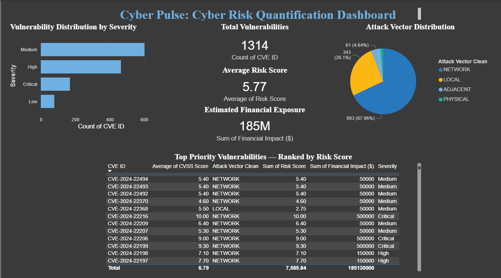

# 🛡️ CyberPulse — Cyber Risk Quantification Dashboard

> **Quantifying organizational cyber risk exposure through vulnerability analysis and financial impact estimation.**
> A cybersecurity analytics project that translates CVSS vulnerability data into business-language risk intelligence — built for analysts, presented for executives.

---

## 📌 Project Overview

CyberPulse is a cybersecurity analytics project that ingests vulnerability data, applies a risk scoring model based on CVSS severity, estimates financial exposure, and surfaces findings through an executive-ready Power BI dashboard.

The core question this project answers:

**"What is the estimated financial impact of our organization's current vulnerability landscape?"**

Total exposure identified: **$185,000,000** across scored risk categories.

---

## 📊 Dashboard Preview



---

🏗️ Project Workflow

Raw Vulnerability Data
        │
        ▼
┌──────────────────────┐
│   Python ETL Layer   │  ← cyber_risk_analysis.ipynb
│  Data cleaning,      │
│  enrichment, prep    │
└────────┬─────────────┘
         │
         ▼
┌──────────────────────┐
│   Risk Scoring       │  ← CVSS-based severity scoring
│   Engine             │     weighted by vulnerability
│                      │     distribution and frequency
└────────┬─────────────┘
         │
         ▼
┌──────────────────────┐
│  Financial Exposure  │  ← Severity-weighted exposure
│  Estimation          │     estimation model
│  ($185M total)       │
└────────┬─────────────┘
         │
         ▼
┌──────────────────────┐
│  cyber_risk_final    │  ← Clean, analysis-ready dataset
│       .csv           │
└────────┬─────────────┘
         │
         ▼
┌──────────────────────┐
│  Power BI Dashboard  │  ← cyberPulse_dashboard.pbix
│  Executive KPIs,     │
│  risk breakdowns,    │
│  visual storytelling │
└──────────────────────┘

---

## 📂 Repository Structure

```
cyber-risk-quantification-dashboard/
│
├── cyber_risk_analysis.ipynb
├── cyberPulse_dashboard.pbix
├── data/
│   └── cyber_risk_final.csv
├── screenshots/
│   └── cyberpulse-dashboard-overview.png
└── README.md
```

---

## ⚙️ What This Project Does

| Component                        | What It Actually Does                                 |
| -------------------------------- | ----------------------------------------------------- |
| 🔄 Data Processing               | Cleans and structures vulnerability data using Python |
| 🎯 Risk Scoring                  | Uses CVSS scores to evaluate vulnerability severity   |
| 💰 Financial Exposure Estimation | Estimates potential business impact (~$185M)          |
| 📊 Power BI Dashboard            | Visualizes KPIs and risk insights                     |
| 📁 Data Export                   | Produces a clean dataset for reporting                |

---

## 🔢 Key Findings

* 💥 **Total Estimated Exposure:** $185,000,000
* 🔴 **Critical Vulnerabilities:** 169
* 🟠 **High Severity Vulnerabilities:** 465
* 📋 **Total Records Analyzed:** 1314
* 📅 **Dataset Source:** Public vulnerability dataset (NVD-style)

---

## 🛠️ Tech Stack

* Python
* Pandas
* NumPy
* Power BI
* Jupyter Notebook

---

## 📖 How to Run

1. Clone the repository

git clone https://github.com/reshmakeshireddy1021-bit/cyber-risk-quantification-dashboard.git

2. Install dependencies

pip install pandas numpy matplotlib seaborn jupyter

3. Run notebook

jupyter notebook

4. Open dashboard

Open `cyberPulse_dashboard.pbix` in Power BI Desktop and refresh the data

---

## 📊 Dashboard Highlights

* Executive Summary — total vulnerabilities, risk score, exposure
* Severity Distribution — Critical, High, Medium, Low
* Attack Vector Analysis — Network, Local, Adjacent, Physical
* Top Vulnerabilities — ranked by risk score
* Risk Insights — distribution patterns

---

## 💡 Design Notes

* Financial exposure is estimated using severity-based approximation
* CVSS is used as the primary risk scoring framework
* Focus is on analytics and business interpretation

---

## 🔭 Future Improvements

* Integrate real-time CVE data feeds
* Improve financial modeling
* Automate pipeline
* Deploy dashboard online
* Add predictive analytics

---

## 👤 Author

Reshma Keshireddy
Cybersecurity & Data Analytics

LinkedIn: https://linkedin.com/in/reshma-keshireddy-1283b91b6
GitHub: https://github.com/reshmakeshireddy1021-bit

---

> "Good security analytics doesn't just find risk — it helps leadership understand what that risk costs."
